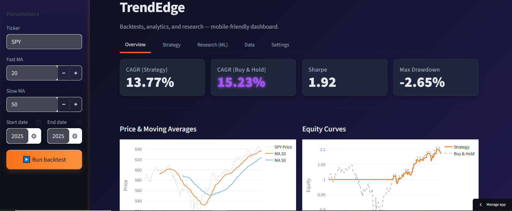

# TrendEdge — Moving Average Strategy Backtester

Interactive Streamlit app to explore moving-average crossover strategies with clean visuals, key metrics, and CSV export.

## Quickstart - if you want to run the app locally
```bash
# 1) Create & activate a venv (Python 3.11 recommended)
python -m venv .venv
# Windows (PowerShell)
.\.venv\Scripts\Activate.ps1
# macOS/Linux
# source .venv/bin/activate

# 2) Install deps
pip install -r requirements.txt

# 3) Run the app
streamlit run app.py
```
**Features**
- Bullet item
  - MA crossover signals with next-bar execution (no look-ahead).

  - Equity curves: Strategy vs Buy & Hold.

  - Metrics: CAGR, Sharpe, Max Drawdown.

  - Validated inputs and optional date range.

  - Price + MA overlay and candlestick chart.

  - Signals preview table (1 = long, 0 = flat).

  - Cached data downloads (faster reruns).

  - One-click CSV export of results.

  - Notes & educational disclaimer included.
    
  - (Optional prototype in the app: simple ML classifier for P(up next day).)

  - Notes & educational disclaimer
- Another item


**Screenshots**
Main View
## Screenshots



**Live demo:** [trendedge.streamlit.app](https://trendedge.streamlit.app)  
**Code:** [github.com/abold/TrendEdge](https://github.com/abold/TrendEdge)
